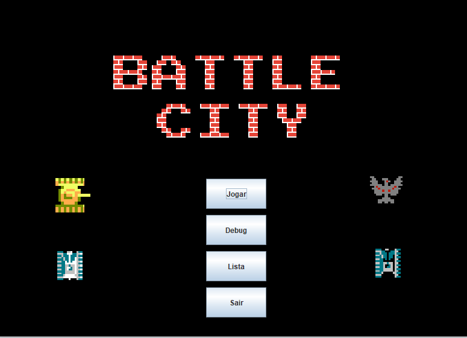
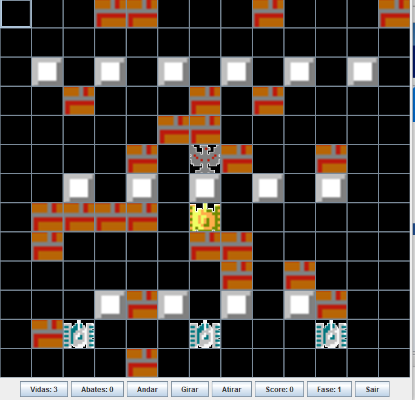

# BattleCity
The classic game "Battle City" written entirely on Java!

## Game modes
The game comes with 2 modes, "Play" and "Debug", and it also stores your scores!

## Gameplay
Depending on which tank you choose, you'll have different attributes to your firing range and destruction potential. The objective is to protect your eagle and defeat the AI tanks!

